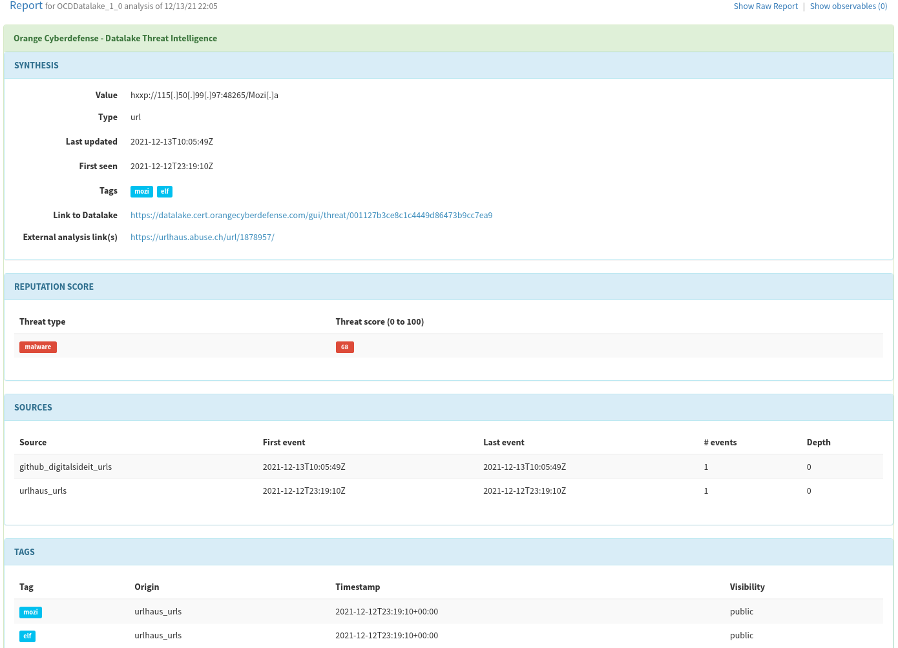

### Orange Cyberdefense Datalake 
Get intelligence and reputation from domain names, FQDN, IP adresses (v4 & v6), urls, file hashes, email,  using the
 [OCD Datalake](https://datalake.cert.orangecyberdefense.com/) Threat Intelligence Database.

#### Requirements
 You need a valid subscription to [OCD Datalake](https://datalake.cert.orangecyberdefense.com/) to use the analyzer:

- Provide your Datalake username as a value for the `username` parameter.
- Provide your Datalake password as a value for the `password` parameter.

To get any help feel free to contact team@cert.orangecyberdefense.com.

### TheHive template 

